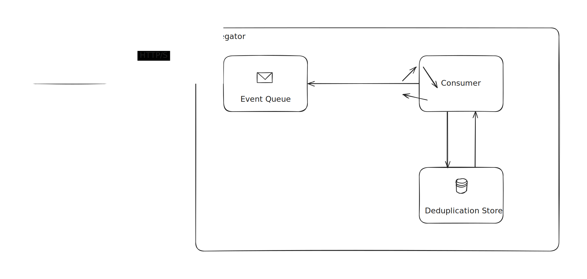
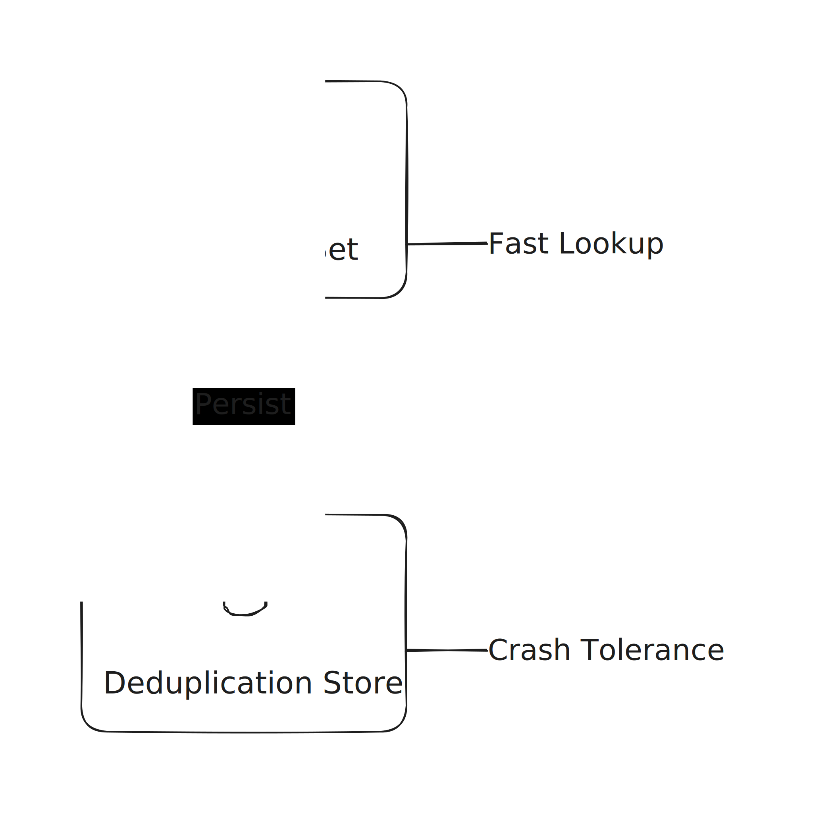

# Laporan: Publish-Subscribe Log Aggregator
Nama  : Pahril Dwi Saputra<br/>
NIM   : 11221056<br/>
Kelas : Sistem Parallel dan Terdistribusi B

# Ringkasan Sistem dan Arsitektur
Sistem **Publish-Subscribe Log Aggregator** dengan **idempotent consumer** dan **deduplication** yang dibangun menggunakan `Python`, `FastAPI`, dan `asyncio`. Sistem dirancang *crash-tolerant* dengan *persistent deduplication store* menggunakan `SQLite`.

*Event* yang dikirim oleh *publisher* akan diterima oleh *aggregator* melalui HTTP POST *request*. *Aggregator* menyimpan *event* ke dalam *in-memory queue* dan memprosesnya menggunakan *consumer service*. Untuk mencegah pemrosesan *duplicate events*, sistem menggunakan *persistent deduplication store* yang dibangun dengan `SQLite` yang menyimpan kombinasi unik dari `event_id` dan `topic`.



Sistem ChronicleWeaver terdiri dari dua *main services*:
### 1. Aggregator Service
*Service* utama yang menerima dan memproses *event* dengan fitur:
- **Statistics**          : Monitoring *received*, *processed*, dan *dropped events*
- **Consumer Service**    : *Background worker* yang memproses *event*
- **Deduplication Store** : *Persistent storage* untuk mencegah *event* duplikat
- **Event Publisher API** : Menerima *single* atau *batch events* melalui HTTP POST
- **Event Queue**         : *In-memory queue* untuk *pipelining* antara *publisher* dan *consumer*

### 2. Publisher Service
*Service* untuk *stress testing* yang mengirim 5000 *events* ke *aggregator* dengan 20% *duplicate events* untuk validasi sistem.

# Keputusan Design

## 1. Idempotency
### Keputusan
Sistem mengimplementasikan **idempotent consumer** menggunakan *composite key* `(event_id, topic)` untuk *deduplication*.

### Alasan
- **At-Least-Once Delivery**: Dalam *distributed systems*, *events* dapat dikirim ulang karena *network failures*, *timeouts*, atau *retries*
- **Data Integrity**: Tanpa *idempotency*, *duplicate events* akan diproses berkali-kali, menyebabkan *inconsistent state*
- **Simplicity**: Sederhana namun efektif untuk mencegah duplikasi pada *log aggregation*

### Implementasi
- *Event* dengan `event_id` dan `topic` yang sama dianggap *duplicate*
- *First-wins policy*: Hanya *event* pertama yang diproses
- *In-memory set* untuk *fast lookup* dengan *persistent backing* di `SQLite`

## 2. Deduplication Store
### Keputusan
Menggunakan **SQLite** sebagai *persistent deduplication store* dengan *in-memory cache*.

### Alasan
- **Crash Tolerance**: *Deduplication state* harus *survive* *service restarts*
- **Local-Only Requirement**: Tidak menggunakan *external services* (Redis, DynamoDB, etc.)
- **Performance**: `SQLite` cukup cepat untuk *single-instance*

### Implementasi


### Schema
**Table: processed_events**
- `event_id` (TEXT)
- `topic` (TEXT)
- `source` (TEXT)
- `payload` (TEXT)
- `timestamp` (TEXT)
- PRIMARY KEY: `(event_id, topic)`

**Table: stats**
- `received` (INTEGER)
- `duplicated_dropped` (INTEGER)
- `topics` (TEXT/JSON array)

## 3. Ordering
### Keputusan
Sistem tidak mengimplementasikan *total ordering*.

### Alasan
- **Performance* vs *Consistency Trade-off**: *Total ordering* memerlukan *serialization*, membuat *bottleneck*
- **Use Case Nature**: *Log aggregation* tidak selalu memerlukan *strict ordering*
- **Throughput Priority**: *Better throughput* lebih penting daripada *strict ordering* untuk *monitoring/logging*

## 4. Retry Mechanism
### Keputusan
Tidak melakukan *retry* untuk *event processing*.

### Alasan
- **Idempotency**: *Duplicate events* akan di-*drop* secara otomatis
- **No External Dependencies**: Tidak ada *downstream services* yang perlu *retry*

# Analisis Performance dan Metrics
Berdasarkan *benchmark* yang dilakukan dengan mengirim 5000 *events* dengan rasio duplikasi 20%, sistem menunjukkan performa sebagai berikut:

## Konfigurasi Benchmark
- **Total Events**: 5000 *events*
- **Duplicate Ratio**: 20% (1000 *duplicate events*)
- **Expected Unique Events**: 4000
- **Batch Size**: 10 *events* per *batch*

## Hasil Evaluasi
### 1. Throughput Analysis
Sistem menunjukkan kemampuan *throughput* yang signifikan pada fase *publishing*, namun mengalami penurunan pada fase *processing*:
- **Total Events Sent**: 5000 *events*
- **Events Received**: 5000 *events*
- **Unique Events Processed**: 4000 *events*
- **Duplicate Events Dropped**: 1000 *events*
- **Overall Throughput**: 88.95 *events*/detik
- **Processing Throughput**: 72.09 *events*/detik
- **Publishing Throughput**: 6870.61 *events*/detik

*Publishing throughput* sebesar 6870.61 *events*/detik menunjukkan bahwa *in-memory queue* sebagai *buffer* antara *publisher* dan *consumer* bekerja dengan efisien. Namun, *processing throughput* sebesar 72.09 *events*/detik menunjukkan *trade-off* yang diambil untuk menjaga *data integrity* melalui *persistent deduplication store* menggunakan `SQLite`, yang mana menambah *overhead* pada setiap operasi *write*.

### 2. Latency Analysis
Sistem menunjukkan karakteristik *latency* yang berbeda antara fase *publishing* dan *processing*:
- **Publish Latency**: 0.728 detik
- **Processing Latency**: 55.485 detik
- **Total Latency**: 56.213 detik
- **Average Per-Event Latency**: 13.87 milidetik

*Publish latency* sebesar 0.728 detik untuk 5000 *events* mengkonfirmasi bahwa keputusan untuk tidak mengimplementasikan *total ordering* memungkinkan sistem untuk menghindari *serialization bottleneck*. *Average per-event latency* sebesar 13.87 milidetik menunjukkan bahwa meskipun terdapat *overhead* dari `SQLite` untuk *persistence*, *latency* per-*event* masih dalam rentang yang cukup baik. *Processing latency* yang lebih tinggi mencerminkan *trade-off* antara *performance* dan *crash tolerance*, di mana sistem diprioritaskan untuk menjaga *deduplication state* secara *persistent* agar dapat *survive service restarts*.

### 3. Duplicate Rate Analysis
Sistem menunjukkan efektivitas mekanisme *deduplication* yang sempurna:
- **Input Duplicate Ratio**: 20%
- **Detected Duplicate Rate**: 20%
- **Expected Unique Events**: 4000 *events*
- **Actual Unique Events**: 4000 *events*
- **Deduplication Accuracy**: 100%

Hasil ini mengkonfirmasi bahwa implementasi *idempotent consumer* dengan *composite key* `(event_id, topic)` dan *persistent deduplication store* bekerja dengan sempurna. Semua 1000 *duplicate events* (20% dari 5000 *events*) berhasil dideteksi dan di-*drop* tanpa kehilangan satupun *unique event*. *Deduplication accuracy* 100% menunjukkan bahwa tidak ada *false positives* (menolak *unique events*) maupun *false negatives* (menerima *duplicate events*).

### 4. Data Integrity
- **Validation Status**: PASSED
- **Result**: Semua 4000 *unique events* diproses tanpa *data loss*

Sistem berhasil memproses semua *unique events* tanpa kehilangan data, yang mengkonfirmasi bahwa kombinasi *idempotency* dan *deduplication* efektif dalam mencapai *eventual consistency*. Meskipun sistem mengimplementasikan *at-least-once semantics* yang memungkinkan *duplicate events*, mekanisme *deduplication* memastikan bahwa setiap *unique event* hanya diproses satu kali, menjaga *data integrity* dan mencegah *inconsistent state*.

# Keterikatan ke Bab 1-7
### T1 (Bab 1): Jelaskan karakteristik utama sistem terdistribusi dan *trade-off* yang umum pada desain *Pub-Sub log aggregator*.
Sistem terdistribusi terdiri atas sistem komputer yang terhubung dalam *network*, di mana *processes* dan *resources* disebar secara *sufficiently* di berbagai mesin (Steen & Tanenbaum, 2023). Karakteristiknya dapat diketahui dari *design goals*-nya. Menurut Steen & Tanenbaum (2023), ada 6 *design goals*, yaitu:
1. *Resource sharing*: Memfasilitasi akses *seamless* dan penggunaan *remote resources* seperti *storages*, *services*, dan lain-lain.
2. *Distributed transparency*: Menyembunyikan penyebaran *processes* dan *resources* yang terdistribusi *across multiple computers* dari *end-users* dan *applications*, umumnya diterapkan menggunakan *middleware layer*, dan memiliki beberapa bentuk *transparency*.
3. *Openness*: Sistem terdistribusi yang menawarkan *components* yang mudah digunakan dan diintegrasikan ke dalam sistem lain, dan sebaliknya. Untuk itu *components* harus mengikuti *standard* seperti Interface Definition Language (IDL).
4. *Dependability*: Serangkaian persyaratan agar sistem dapat dipercaya, seperti *availability*, *reliability*, *safety*, dan *maintainability*. *Design* ini bergantung pada *fault tolerance*, yaitu penggunaan *redundancy* menyembunyikan *faults*.
5. *Security*: Prasyarat penting untuk sistem yang *dependable* dan berfokus pada penjaminan *confidentiality* serta *integrity*, keduanya secara langsung terkait dengan *authorized disclosure* dan *access* pada informasi dan *resources*.
6. *Scalability*: Kemampuan sistem untuk menangani pertumbuhan dalam berbagi dimensi, termasuk *size*, *geographical*, dan *administrative* tanpa penurunan *performance* yang signifikan.

*Trade-off* dari Publish-Subscribe Log Aggregator salah satunya *scalability* yang mudah terkorbankan pada *layer coordination*: implementasi *efficient and scalable distributed event matching* sulit. Jika *filtering* memerlukan *expressive subscriptions*, proses *matching* dapat *bottleneck*. Ketika *security* dan *privacy* (seperti menjaga *mutual anonymity* dan *confidentiality* data dari *untrusted brokers*) dipertimbangkan, timbul *trade-off* pada kompleksitas implementasi, yang mana seringkali memerlukan solusi rumit seperti *searchable encryption* (*PEKS*), yang dapat menciptakan *bottleneck* *performa* tambahan.

### T2 (Bab 2): Bandingkan arsitektur *client-server* vs *publish-subscribe* untuk *aggregator*. Kapan memilih *Pub-Sub*? Berikan alasan teknis.
Pada *client-server architecture*, *processes* dibagi menjadi dua, yaitu *server* dan *client*. *Server* adalah *process* yang mengimplementasikan *specific service*, misalnya *web server*. *Client* adalah adalah *process* yang me-*request* *service* dari *server* dengan mengirimkan *request* dan *subsequently waiting* untuk *response* dari *server* (Steen & Tanenbaum, 2023). Karena secara inheren *architecture* ini bersifat *synchronous*, maka pada *log aggregator*, *client* sebagai sumber *log events* harus menunggu *response* dari *server* setelah mengirimkan *event*, sehingga dapat menghambat *throughput* dan menambah *latency*. Selain itu, *architecture* ini *tight coupling*, di mana *client* dan *server* harus *up and running* dan saling mengetahui lokasi dan referensi secara eskplisit saat komunikasi terjadi, sehingga mengurangi *scalability* dan *fault tolerance*.

Sedangkan, arsitektur *publish-subscribe* didasarkan pada *message-oriented communication* atau *event-based communication*, yang memisahkan antara *business logic* dan *coordination mechanism* (Steen & Tanenbaum, 2023). Keuntungannya adalah *loose coupling*, di mana *publishers* sebagai sumber *log events* dan *subscribers* sebagai *aggregator* tidak perlu saling mengetahui (*referentially decoupled*). Selain itu, komunikasi dapat *persistent* (bersifat *message-queuing*), di mana pesan disimpan oleh *middleware* sampai berhasil dikirimkan, sehingga *sender* dan *receiver* tidak perlu *up and running* secara bersamaan (*temporally decoupled*).

*Publish-subscribe architecture* dipilih ketika *design goal* sistem adalah untuk mencapai *loose coupling* antar *components*, meningkatkan *scalability*, dan *fault tolerance*. *Architecture* ini menyediakan *decoupling* baik, terutama *referential decoupling*, di mana *publishers* sebagai penerbit tidak perlu memiliki *explicit reference* atau *identifier*, *location*, atau status dari *subscribers* sebagai penerima. Dalam sistem yang besar dan kompleks di mana *processes* bisa *easily join or leave*, *loose coupling* sangat penting untuk meningkatkan *scalability* dan *fault tolerance*. Dalam kasus *log aggregator*, *publish-subscribe architecture* memungkinkan *publishers* untuk mengirim *log events* tanpa perlu menunggu *subscribers* untuk siap menerima.

### T3 (Bab 3): Uraikan *at-least-once* vs *exactly-once delivery semantics*. Mengapa *idempotent consumer* krusial di *presence of retries*?
*At-least-once semantics* adalah jaminan bahwa sebuah pengiriman pesan akan dieksekusi setidaknya satu kali, namun terdapat kemungkinan pesan yang sama dikirim lebih dari satu kali (Steen & Tanenbaum, 2023). Pendekatan ini digunakan ketika *client* menghadapi *network failures* atau *timeouts* pada sisi *server*, sehingga *client* akan terus mencoba (*retry*) mengirim pesan sampai mendapatkan *response* sukses dari *server*. Namun, pendekatan ini dapat menyebabkan *duplicate messages* yang dapat mengakibatkan *inconsistent state* pada *consumer* jika pesan yang sama diproses lebih dari sekali. Sebaliknya, *exactly-once semantics* menjamin bahwa setiap pesan akan diproses tepat satu kali, tanpa duplikasi. Namun, secara umum, *exactly-once delivery* sangat sulit atau bahkan tidak mungkin dijamin dalam *distributed systems* karena adanya kegagalan *server* dan kehilangan pesan tidak dapat dihindari (Steen & Tanenbaum, 2023).

*Idempotent consumer* krusial di *presence of retries* karena memungkinkan *consumer* untuk memproses pesan yang sama berkali-kali tanpa menimbulkan efek samping atau "kerusakan" pada sistem. Misalnya dalam sistem *log aggregator*, jika sebuah *event* dikirim ulang karena kegagalan jaringan, *idempotent consumer* dapat mengenali bahwa *event* tersebut sudah pernah diproses sebelumnya (misalnya dengan menggunakan `event_id` dan `topic` sebagai unique identifier) dan mengabaikan pemrosesan ulangnya. Dengan demikian, *idempotent consumer* menjaga *data integrity* dan konsistensi sistem meskipun terjadi *retries*.

### T4 (Bab 4): Rancang skema penamaan untuk `topic` dan `event_id` (unik, *collision-resistant*). Jelaskan dampaknya terhadap *dedup*.
Untuk `topic`, skema penamaan yang efektif adalah *structured naming* yang hierarkis, mirip dengan *Domain Name System* (DNS) atau *file system* (Steen & Tanenbaum, 2023). Skema hierarkis seperti ini memungkinkan *subscriber* untuk membuat *subscription* berdasarkan kategori atau *wildcard* yang mana sangat berguna dalam sistem *topic-based publish-subscribe*.
Contoh skema penamaan `topic`:
```
domain.entity.action.version

shipping.order.created.v1
```
Keuntungan dari penamaan ini, `topic` menjadi `human-friendly` dan memudahkan *name resolution* jika sistem berkembang menjadi lebih besar dan kompleks.

Untuk memastikan keunikan dan *collision-resistance* pada `event_id`, tidak dapat hanya memanfaatkan *sequential IDs* atau *timestamps* sederhana, karena *network latencies* memiliki *natural lower bound* (Steen & Tanenbaum, 2023). Skema yang lebih baik adalah dengan mengombinasikan beberapa elemen unik, seperti misalnya source identifier, timestamp (*Lamport's logical clock* atau *vector clock*), dan *local incremental sequence number* untuk membedakan *event* yang dihasilkan berdekatan dari sumber yang sama. Untuk mencapai *collision-resistant* yang tinggi, hasil kombinasi tersebut perlu di-*hash* menggunakan *cryptographic hash function* seperti SHA-256 yang menghasilkan *digest* `event_id`. Contoh skema penamaan `event_id`:
```
SHA256(source_id + timestamp + local_sequence_number)
```
Dampak dari skema penamaan yang unik dan *collision-resistant* terhadap *deduplication* adalah untuk mengidentifikasi *duplicate events* dengan akurat, tanpa `event_id` yang unik, *receiver* atau *middleware* akan sulit membedakan antara *new events* dan *duplicate events*. Dengan `event_id` yang unik, *processing* dapat menjadi *idempotent*, di mana *duplicate events* dapat di-*drop* tanpa mempengaruhi *system state*.

### T5 (Bab 5): Bahas *ordering*: kapan *total ordering* tidak diperlukan? Usulkan pendekatan praktis (mis. *event timestamp* + *monotonic counter*) dan batasannya.
*Total ordering* diperlukan untuk memastikan bahwa semua proses *non-faulty* dalam sistem menerima dan memproses serangkaian *events* dalam urutan yang sama seperti dalam *state machine replication* (Steen & Tanenbaum, 2023). Namun, *total ordering* tidak selalu diperlukan, misalnya ketika sistem dapat mentoleransi *weaker consistency*, terutama jika *event* yang terjadi bersifat *concurrent* dan tidak *causally related* (Steen & Tanenbaum, 2023).

Pendekatan praktis untuk mengelola *ordering* adalah *Lamport's Logical Clocks*, pendekatan ini memastikan bahwa jika suatu *event* `a` terjadi sebelum *event* `b` (dilambangkan sebagai `a -> b`), maka *timestamp* dari `a` akan lebih kecil dari *timestamp* dari `b` (Steen & Tanenbaum, 2023). Namun, pendekatan ini memiliki batasan, yaitu tidak dapat menangkap *causality*, misalnya antara *event* `a` dan *event* `b` tidak dapat disimpulkan berhubungan hanya dengan membandingkan nilai waktunya (Steen & Tanenbaum, 2023). Artinya, pendekatan ini hanya memberikan ordering yang konsisten, tetapi tidak memberikan informasi apakah event yang lebih awal diurutkan secara logis tersebut benar-benar menjadi penyebab atau memengaruhi *event* yang terjadi kemudian.

### T6 (Bab 6): Identifikasi *failure models* (duplikasi, *out-of-order*, *crash*). Jelaskan strategi mitigasi (*retry*, *backoff*, *durable dedup store*).
*Failure models* seperti *duplication*, *out-of-order delivery*, dan *crash failures* dapat timbul akibat sistem yang *partially synchronous*, di mana batas waktu pengiriman pesan tidak terjamin, dan *failure detection* sering bergantung pada mekanisme *timeout* yang rawan *false positives* (Steen & Tanenbaum, 2023).
- *Duplication* umumnya terjadi karena *omission failures* pada *network* atau *server*, misalnya ketika *publisher* mengirim pesan, jika *publisher* tidak menerima *acknowledgment* (ACK) dalam batas waktu tertentu, *publisher* akan mengasumsikan pesan tersebut hilang dan otomatis melakukan *retransmission* (Steen & Tanenbaum, 2023). *Retransmission* yang bertujuan untuk menjamin *at-least-once semantics* dapat menyebabkan *subscriber* menerima *log* yang sama lebih dari sekali jika ACK sebelumnya hanya tertunda.
- *Out-of-order* dapat terjadi meskipun menggunakan protokol komunikasi *point-to-point* yang *reliable* seperti Transmission Control Protocol (TCP), ketika pesan datang dari berbagai *publishers* atau melalui *middleware* yang berbeda, tidak ada jaminan urutan penerimaan sama dengan urutan kejadian sebenarnya (Steen & Tanenbaum, 2023).
- *Crash failure* terjadi ketika *server* *prematurely halts*, tapi masih bekerja sampai benar-benar berhenti. Aspek penting dari *crash failure* adalah setelah *server* berhenti, tidak ada lagi *response* yang dapat diterima dari *server* (Steen & Tanenbaum, 2023).

Untuk memitigasi *failure models* tersebut, beberapa strategi dapat diterapkan:
- Untuk mengatasi *omission failures*, *client* atau *publisher* harus menerapkan mekanisme *retry*. Namun, agar *retry* tidak membebani *server*, *exponential backoff* dapat digunakan, di mana waktu tunggu antara *retries* meningkat secara eksponensial setelah setiap kegagalan.
- Untuk mengatasi *out-of-order*, protokol harus diperkuat untuk *causally ordered multicasting* (menggunakan *vector timestamps*) atau *totally ordered multicasting* (Steen & Tanenbaum, 2023).
- Untuk mengatasi *crash failures*, penggunaan *durable deduplication store* memungkinkan sistem untuk menyimpan status *deduplication* secara *persistent*, sehingga ketika *server* di-*restart*, sistem dapat melanjutkan dari status terakhir tanpa kehilangan informasi tentang *events* yang sudah diproses.

### T7 (Bab 7): Definisikan *eventual consistency* pada *aggregator*; jelaskan bagaimana *idempotency* + *dedup* membantu mencapai konsistensi.
*Eventual consistency* adalah salah satu dari *data-centric consistency model*, *data store* yang *eventually consistent* memiliki properti bahwa, jika tidak ada operasi *write* yang saling bertentangan (*write-write conflicts*) terjadi dalam waktu yang lama, semua replika data akan berangsur-angsur *converge* menjadi salinan yang identik (Steen & Tanenbaum, 2023). Pada *aggregator*, *eventual consistency* berarti meskipun *events* dapat diproses dalam urutan yang berbeda atau beberapa *events* mungkin tertunda, pada akhirnya semua *unique events* yang diterima akan diproses dan menghasilkan hasil yang konsisten.

*Idempotency* dan *deduplication* dapat membantu dalam mencapai konsistensi pada *aggregator*. Dengan *idempotent consumer*, meskipun *events* yang sama diterima dan diproses berkali-kali (misalnya karena *retries*), hasil akhir dari pemrosesan tetap konsisten karena efek samping dari pemrosesan ulang diabaikan. Dengan *deduplication store*, sistem dapat mengidentifikasi dan mengabaikan *duplicate events*, sehingga hanya *unique events* yang diproses. Oleh karena itu, gabungan dari kedua mekanisme ini dapat membantu dalam mencapai konsistensi meskipun terjadi *retries* akibat *network failures*, sistem tetap dapat mencapai konsistensi tanpa kehilangan data atau menghasilkan hasil yang tidak konsisten.

### T8 (Bab 1-7): Rumuskan metrik evaluasi sistem (*throughput*, *latency*, *duplicate rate*) dan kaitkan ke keputusan desain.
*Throughput* mengukur jumlah *events* yang dapat diproses sistem per satuan waktu, dan merupakan indikator dari *scalability* sistem (Steen & Tanenbaum, 2023). Pada sistem *log aggregator*, *throughput* tinggi sangat penting karena sistem harus mampu menangani *events* yang banyak dari berbagai *publishers* secara bersamaan. Keputusan desain untuk menggunakan *in-memory queue* sebagai *buffer* antara *publisher* dan *consumer* memungkinkan *aggregator* untuk menerima *events* dengan cepat tanpa memblokir *publishers*, sehingga mampu meningkatkan *throughput*. Namun, terdapat *trade-off* karena mempertimbangkan *deduplication* menggunakan `SQLite` sebagai *persistent store*, yang mana menambah *overhead* pada *processing* dan dapat menurunkan *throughput* dibandingkan jika hanya menggunakan *in-memory storage*.

*Latency* mengukur waktu yang dibutuhkan dari saat *event* diterima hingga selesai diproses, dan merupakan aspek penting dari *responsiveness* sistem (Steen & Tanenbaum, 2023). *Latency* dapat dipengaruhi oleh berbagai faktor seperti *network delays*, *processing time*, dan *queuing delays*. Keputusan untuk tidak mengimplementasikan *total ordering* pada sistem *aggregator* bertujuan untuk menghindari *serialization* yang dapat menyebabkan *bottleneck* dan meningkatkan *latency*. Selain itu, penggunaan *asynchronous processing* dengan `asyncio` memungkinkan sistem untuk menangani multiple *events* secara *concurrent* tanpa blocking, yang dapat meningkatkan *latency*.

*Duplicate rate* mengukur *duplicate events* yang berhasil dideteksi dan di-*drop* oleh sistem, dan merupakan indikator efektivitas mekanisme *deduplication*. Dalam sistem yang mengimplementasikan *at-least-once semantics*, *duplicate events* tidak dapat dihindari akibat *retries* dari *publishers* terjadi *network failures*. Keputusan desain untuk mengimplementasikan *idempotent consumer* dengan *persistent deduplication store* bertujuan untuk mencapai *duplicate rate* yang rendah atau *ideally zero*, sehingga menjaga *data integrity* dan mencegah *inconsistent state*. Penggunaan *composite key* `(event_id, topic)` sebagai *unique identifier* bertujuan agar *aggregator* dapat mendeteksi duplikasi dengan akurat, dan *deduplication persistence store* dengan `SQLite` dapat mempertahankan state meskipun terjadi *crash failures*.

# Bibliography
Steen, M. van, & Tanenbaum, A. S. (2023). Distributed Systems (4th ed.). Maarten van Steen. https:// www.distributed-systems.net/index.php/books/ds4/
